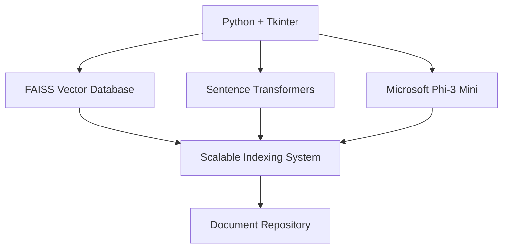

<div align="center">
  
  <h1>DriveWorm v1.0</h1>
  <p><em>Transform Shared Drives into Smart Knowledge Hubs</em></p>
</div>

## :dart: The Challenge

Shared drives often become:
- :maze: Digital labyrinths
- :hourglass: Time sinks for information retrieval
- :lock: Traps for valuable insights
- :confused: Obstacles to leveraging collective knowledge

## :bulb: The Solution

**DriveWorm** is an AI-powered document intelligence system that:
1. Transforms static shared drives into dynamic, searchable knowledge hubs
2. Deeply understands your documents' content
3. Enables natural interactions with your data
4. Supercharges productivity and decision-making

## :star2: Key Capabilities

| Feature | Description |
|---------|-------------|
| :brain: Intelligent Parsing | Understands document context and relationships |
| :mag: Semantic Search | Find information by meaning, not just keywords |
| :robot: AI-Powered Chat | Ask questions about your documents naturally |
| :bar_chart: Smart Organization | Auto-indexes and structures your data |
| :zap: Real-Time Processing | Keeps knowledge base current and accessible |
| :repeat: Multi-Format Support | Handles various document types seamlessly |

## :chart_with_upwards_trend: Business Impact

- :rocket: Transform static storage into interactive knowledge repositories
- :stopwatch: Reduce time spent searching for information by up to 90%
- :bulb: Enable data-driven insights from previously underutilized documents
- :handshake: Improve collaboration through better information accessibility
- :fast_forward: Accelerate decision-making with instant access to relevant data

## :gear: Technical Architecture



## :rocket: Getting Started

1. **Clone repository:**
   ```bash
   git clone https://github.com/yourusername/driveworm.git
   ```

2. **Install dependencies:**
   ```bash
   pip install -r requirements.txt
   ```

3. **Launch DriveWorm:**
   ```bash
   python worm_drive.py
   ```

4. **Select a shared drive** to begin transforming your document storage!

## :trophy: SF GEN AI Challenge

Created for the SF Gen AI Challenge 2024, DriveWorm demonstrates the power of AI in revolutionizing document management and knowledge access. Join us in transforming how organizations interact with their data!

## :video_game: Inspiration

DriveWorm's name and logo are inspired by the beloved 1995 video game "Worms" by Team17. Just as the worms in the game navigated complex terrains with military tactics and precision, DriveWorm navigates through your digital landscape, unearthing valuable information with intelligence and precision.

## :scroll: License

MIT License - See [LICENSE](LICENSE) file for details

---

<div align="center">
  <strong>Transform Your Data Knowledge Today!</strong>
  <br>
  <a href="https://github.com/yourusername/driveworm/issues">Report Bug</a> ·
  <a href="https://github.com/yourusername/driveworm/issues">Request Feature</a>
</div>
